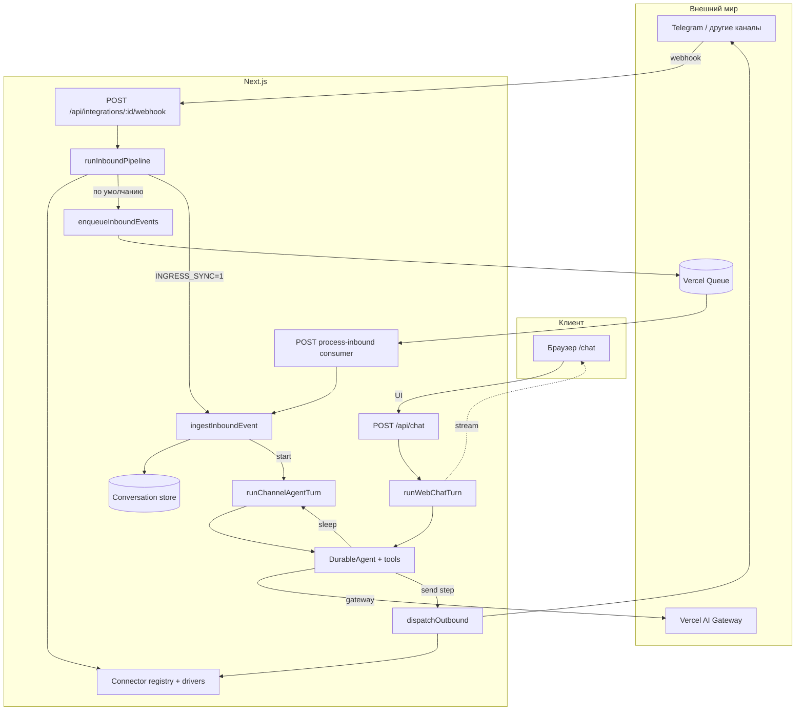

# Chat (ingress + durable agent)

Next.js-приложение: единый webhook для коннекторов, очередь Vercel, durable-workflow с агентом (Vercel AI Gateway) и ответами в мессенджер «как человек» (паузы, несколько пузырей).

**Веб-чат:** страница [`/chat`](app/chat/page.tsx) и `POST /api/chat` — тот же паттерн агента (`typing_pause`, несколько `send_chat_message`), но ответы стримятся в UI как `data-chat-bubble`, без Telegram.

## Архитектура



Два workflow: **`runChannelAgentTurn`** (Telegram через `dispatchOutbound`) и **`runWebChatTurn`** (пузыри в SSE как `data-chat-bubble`). Одинаковые инструкции и инструменты `typing_pause` / `send_chat_message`.

</think>


<｜tool▁calls▁begin｜><｜tool▁call▁begin｜>
Read

### Поток входящего сообщения


## Ключевые идеи

- **Один inbound-route** на все установки: тип канала определяется по `connectorKind` и registry (`docs/ingress.md`).
- **Очередь** буферизует нормализованные события (`inbound-events`), consumer вызывает ingest с ретраями.
- **Агент** — два workflow с одной логикой: `runChannelAgentTurn` (Telegram) и `runWebChatTurn` (браузер); модель через **Vercel AI Gateway** (`gateway()`), тулы `send_chat_message` и `typing_pause` + `sleep()` из Workflow.

## Структура репозитория (сокращённо)

```
app/chat/                                          # UI чата с агентом
app/api/chat/                                      # POST: start(runWebChatTurn) + SSE
app/api/integrations/[installationId]/webhook/   # единый webhook
app/api/queues/process-inbound/                    # consumer inbound-events
core/connectors/                                   # типы, registry
core/inbound/                                      # pipeline, enqueue, ingest, dedupe
core/outbound/                                     # dispatch
core/conversations/                                # in-memory история (заменить на БД)
core/agents/                                       # инструкции агента, проверка Gateway
drivers/                                           # telegram и др.
workflows/channel-agent-turn.ts                    # агент → Telegram
workflows/web-chat-turn.ts                         # агент → UI stream
docs/                                              # заметки по ingress / workflow
tests/integration/                                 # реальный вызов Gateway (опционально)
```

## Переменные окружения

| Переменная | Назначение |
|------------|------------|
| `AI_GATEWAY_API_KEY` | Локально: доступ к [Vercel AI Gateway](https://vercel.com/docs/ai-gateway). На Vercel можно полагаться на OIDC без ключа. |
| `AGENT_MODEL` | ID модели Gateway, например `openai/gpt-4o-mini` (по умолчанию). |
| `TELEGRAM_BOT_TOKEN` | Для outbound demo-установки и реального Telegram. |
| `INGRESS_SYNC=1` | Пропустить очередь, вызывать ingest в том же запросе (отладка). |

## Скрипты

```bash
bun install
bun run dev          # Next.js
bun test             # юнит-тесты
bun run test:agent   # интеграция с реальным Gateway (нужен AI_GATEWAY_API_KEY)
bun run test:agent:local  # то же + .env.local
```

## Документация в репозитории

- `docs/ingress.md` — generic webhook, registry, dispatch.
- `docs/agent-workflow.md` — паттерн single-turn + DurableAgent.
