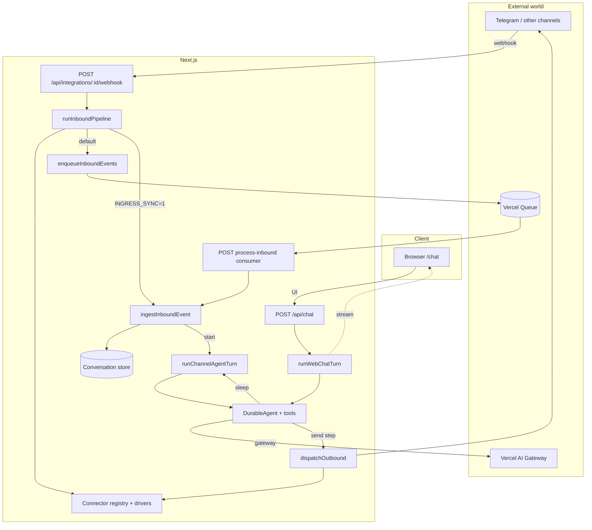
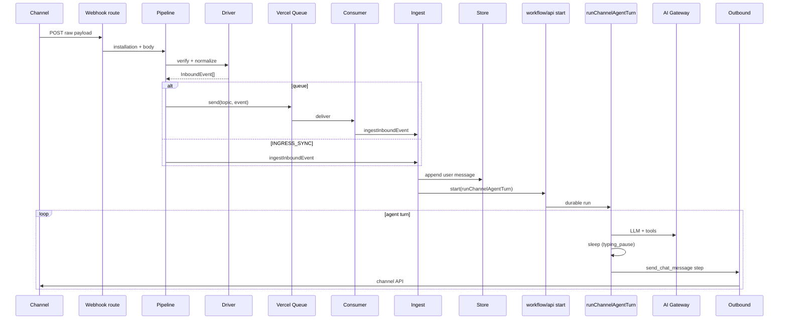

# Chat (ingress + durable agent)

Next.js app: a single webhook for connectors, a Vercel queue, a durable workflow with an agent (Vercel AI Gateway), and messenger replies that feel human (pauses, multiple bubbles).

**Web chat:** [`/chat`](app/chat/page.tsx) and `POST /api/chat` — same agent pattern (`typing_pause`, multiple `send_chat_message`), but responses stream to the UI as `data-chat-bubble` events, not Telegram.

## Architecture



Two workflows: **`runChannelAgentTurn`** (Telegram via `dispatchOutbound`) and **`runWebChatTurn`** (bubbles over SSE as `data-chat-bubble`). Same instructions and tools: `typing_pause` / `send_chat_message`.

## Incoming message flow



## Key ideas

- **One inbound route** for all installations: channel type comes from `connectorKind` and the registry ([`docs/ingress/generic-webhook-dispatch.md`](docs/ingress/generic-webhook-dispatch.md)).
- The **queue** buffers normalized events (`inbound-events`); the consumer calls ingest with retries.
- The **agent** is two workflows with one logic: `runChannelAgentTurn` (Telegram) and `runWebChatTurn` (browser); model via **Vercel AI Gateway** (`gateway()`), tools `send_chat_message` and `typing_pause` + `sleep()` from Workflow.

## Repository layout (abbreviated)

```
app/chat/                                          # Chat UI with agent
app/api/chat/                                      # POST: start(runWebChatTurn) + SSE
app/api/integrations/[installationId]/webhook/   # Single webhook
app/api/queues/process-inbound/                    # inbound-events consumer
core/connectors/                                   # Types, registry
core/inbound/                                      # Pipeline, enqueue, ingest, dedupe
core/outbound/                                     # Dispatch
core/conversations/                                # In-memory history (replace with DB)
core/agents/                                       # Agent instructions, Gateway checks
drivers/                                           # Telegram, etc.
workflows/channel-agent-turn.ts                    # Agent → Telegram
workflows/web-chat-turn.ts                         # Agent → UI stream
docs/                                              # architecture, runtime, product UX, ingress, workflow ([index](docs/README.md))
tests/integration/                                 # Real Gateway call (optional)
```

## Environment variables

| Variable | Purpose |
|----------|---------|
| `AI_GATEWAY_API_KEY` | Local: access to [Vercel AI Gateway](https://vercel.com/docs/ai-gateway). On Vercel you can rely on OIDC without a key. |
| `AGENT_MODEL` | Gateway model id, e.g. `openai/gpt-4o-mini` (default). |
| `TELEGRAM_BOT_TOKEN` | For the outbound demo installation and real Telegram. |
| `INGRESS_SYNC=1` | Skip the queue; call ingest in the same request (debugging). |

## Scripts

```bash
bun install
bun run dev          # Next.js
bun test             # Unit tests
bun run test:agent   # Integration with real Gateway (needs AI_GATEWAY_API_KEY)
bun run test:agent:local  # Same + .env.local
```

## Documentation in this repo

- [docs/README.md](docs/README.md) — table of contents.
- [docs/ingress/generic-webhook-dispatch.md](docs/ingress/generic-webhook-dispatch.md) — single webhook, registry, dispatch.
- [docs/workflow/single-turn-agent.md](docs/workflow/single-turn-agent.md) — single-turn + DurableAgent.
