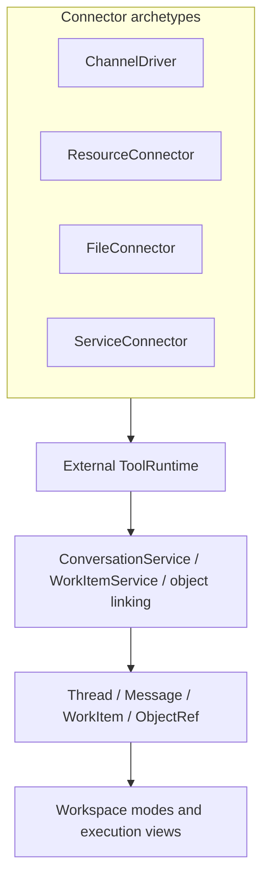

# Operational runtime

How **inbound events**, **domain state**, **agent turns**, and **outbound replies** connect. This doc is the bridge between [architecture](./architecture/connector-archetypes.md) and [product UX](./product/thread-workspace-ux.md).

## End-to-end stack

**Boundary:** external systems never write the UI. They go through normalization and runtime; runtime updates **domain** entities; the UI renders domain state.

## 1. Inbound

1. HTTP hits one generic webhook (see [ingress](./ingress/generic-webhook-dispatch.md)).
2. Load **installation** → `connectorKind` → driver from registry.
3. Optional `verifyWebhook`, then `normalize` → `InboundEvent[]`.
4. For each event, **ingest**: upsert/find **Thread** (keyed by workspace + `Thread.external` ids + installation), append **Message**, dedupe, enqueue optional side effects.

`Thread.external` links the thread to an installation and channel ids — see [thread-work-items-model.md](./product/thread-work-items-model.md).

## 2. Agent turn

The agent (or workflow step) reads:

- **Thread** + **Message** history (and visibility policy),
- **WorkItem**s linked to that thread (and optionally global queue),
- **ObjectRef**s on the thread,
- **ownership** (`owned` vs `observed`) and installation capabilities.

It does **not** read raw connector payloads; those are already normalized.

## 3. Tool calls

| Tool kind    | Target |
| ------------ | ------ |
| **External** | [ToolRuntime](./architecture/platform-ports-and-tool-runtime.md) → connector + installation |
| **Domain**   | `WorkItemService`, `ThreadService`, `ConversationService`, object linking |

Examples: `findOrder` → external; `createTask`, `createReview`, `createDraft`, `linkObject` → domain.

Compose an **AgentRuntime**-shaped surface — see [semantic-agent-tools.md](./architecture/semantic-agent-tools.md).

## 4. Outbound

Public replies go through **ChannelDriver** outbound for the thread’s channel installation (`sendMessage` or equivalent), not ad hoc Telegram calls from random modules.

## 5. Owned vs observed

- **owned** — agent may send public messages (subject to product rules).
- **observed** — read/analyze, create work items and drafts, suggest; typically **no** unsupervised send.

## 6. UI modes

Human and agent actions update the same domain. How **conversation vs work board**, **execution vs chat in the center**, and **right panel** behave is specified in [thread-workspace-ux.md](./product/thread-workspace-ux.md).

## Walkthrough: Telegram, order lookup

1. Inbound `message.created` → thread/message persisted.
2. Agent loads work items + objects; may call **external** `findOrder`.
3. Agent calls **domain** `linkObject` (order) → `ObjectRef` on thread.
4. Agent creates **Draft** or calls **external** `sendMessage` with reply text.
5. UI: conversation updates; right panel shows task/draft/objects.

This narrative is illustrative; schema and services are implemented separately.
